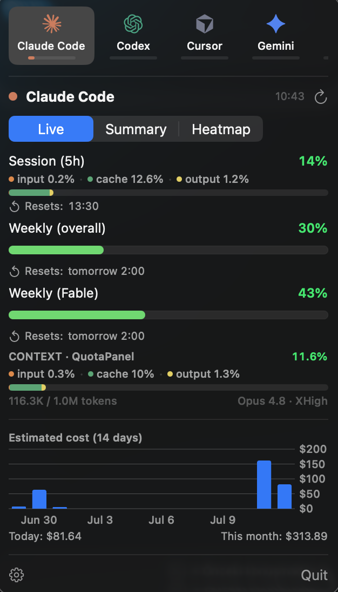
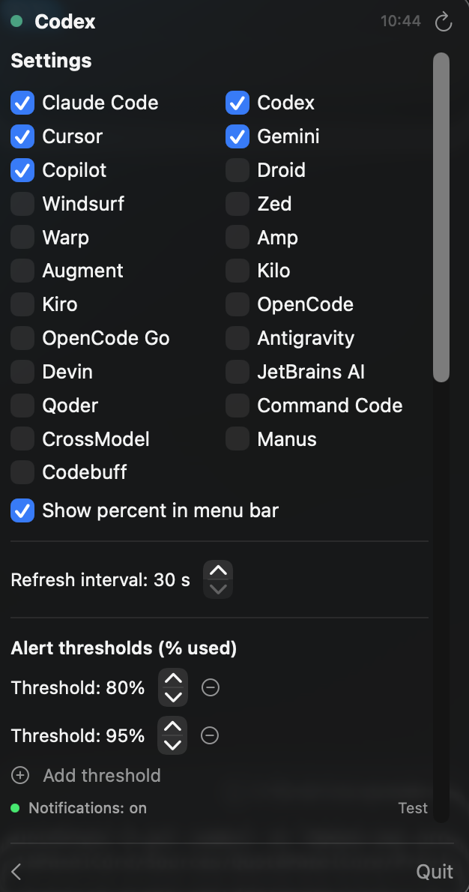
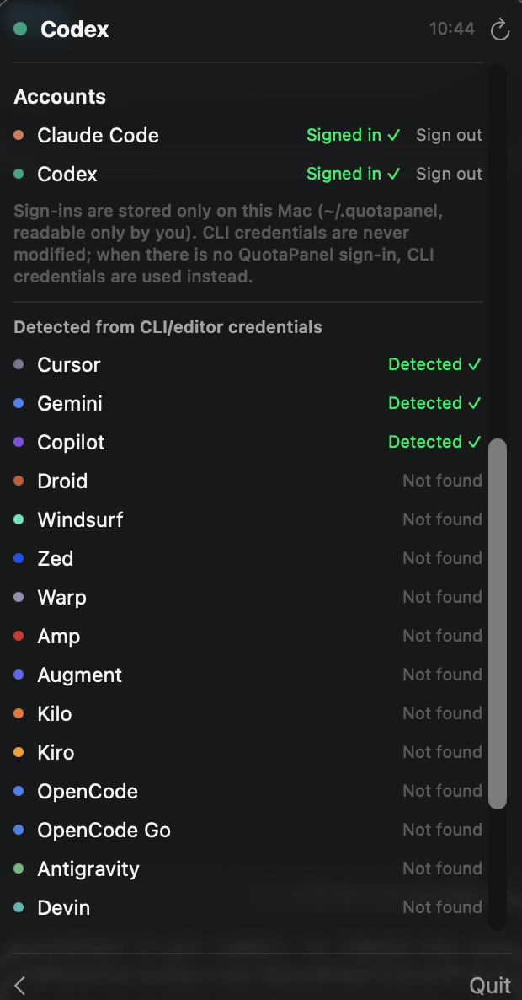
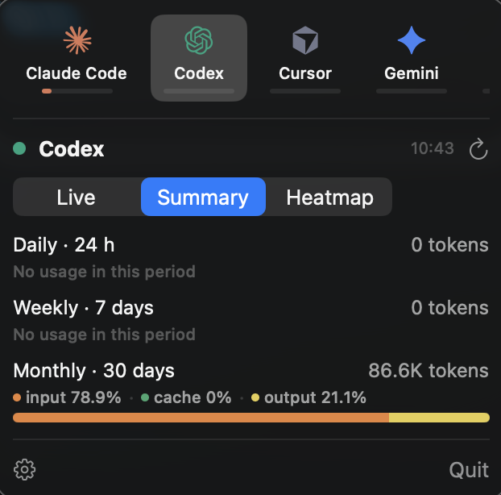
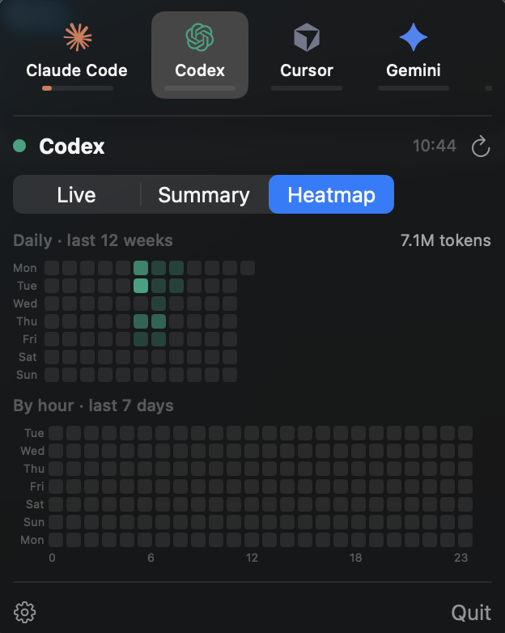

# QuotaPanel

A macOS menu bar app that tracks your AI coding-tool usage quotas at a glance — **Claude Code**, **Codex**, and 20+ more providers. Official rate-limit percentages, per-session context windows, cost/token charts, offline summaries, and heatmaps. No API keys required.

<p align="center">
  
</p>

## Features

- **One panel, provider strip on top** — switch between providers with a click; each provider chip shows its logo, name, and a mini bar that fills to its current **5-hour session usage** (0% → empty, 15% → filled to 15%). The strip scrolls horizontally as you enable more providers.
- **Menu bar shows your 5-hour window** — the menu bar carries the logo of the provider currently open in the panel, with its **5-hour session** usage percent and a color-coded mini bar underneath. Providers without a 5-hour window fall back to their fullest window, so the label is never blank. (See [Menu bar: the 5-hour session window](#menu-bar-the-5-hour-session-window) below.)
- **23 providers, toggle any of them** — Claude Code, Codex, Cursor, Gemini, Copilot, Droid, Windsurf, Zed, Warp, Amp, Augment, Kilo, Kiro, OpenCode, OpenCode Go, Antigravity, Devin, JetBrains AI, Qoder, Command Code, CrossModel, Manus, and Codebuff. Show or hide each one from Settings.

  

- **Zero-setup detection** — besides in-app sign-in for Claude & Codex, QuotaPanel reads the credentials your other CLIs and editors already wrote and shows each as **Detected** / **Not found** in Settings → Accounts. Nothing to configure for a provider you're already logged in to.

  

- **Official rate limits** — Claude's session / weekly / per-model windows come straight from Anthropic's usage endpoint, so they match what Claude Code itself reports. Codex limits come from the ChatGPT backend the codex CLI uses. Every other provider reports the windows its own service exposes (session, daily, weekly, monthly, or credit pools).
- **Context windows** *(Claude & Codex)* — one bar per open session showing how full its context window is (tokens used / window size), labelled with the session's project, model, and reasoning effort (e.g. `CONTEXT · QuotaPanel — Opus 4.8 · XHigh`); Codex sessions also show special collaboration modes like `plan`. Claude sessions are detected from Claude Code's live session registry; Codex from its running process (model and effort come from the rollout's own `turn_context`).
- **Token-type breakdown** — session and context bars split into **input / cache / output** segments, so you can see what your usage is made of (cache *reads* are excluded — they re-count the same history every turn).
- **Summary view** *(Claude & Codex)* — token totals over the last 24 h / 7 days / 30 days, with the same input/cache/output split.

  

- **Heatmap view** *(Claude & Codex)* — a GitHub-style daily grid of the last 12 weeks plus an hour-of-day punch card of the last 7 days.

  

- **Cost & token charts** — estimated Claude cost (USD) and Codex token usage over the last 14 days, with today / this-month totals.
- **Configurable alerts** — add up to 6 usage thresholds (e.g. 50 / 70 / 80 / 90 / 95%); one notification per threshold per window cycle, plus a "limit reset" notification. Fractional percentages (3.1%, 5.4%) are shown wherever the data has them.
- **Sign in from the app** — optional OAuth sign-in for Claude & Codex (see below), so you never need to run `claude` or `codex` in a terminal.

## Menu bar: the 5-hour session window

The menu bar percentage — and the mini bar under each provider chip in the strip — reflect the **5-hour session window**, the short-term limit you're most likely to hit, rather than the largest of a provider's windows. All of a provider's windows (session, weekly, monthly, credits, …) are still shown in the panel; only the single number surfaced in the menu bar is the 5-hour one.

Providers that don't expose a 5-hour window (only weekly / monthly / credit pools) fall back to their fullest window, so the menu bar always shows a meaningful number.

## Download & build

Requirements: **macOS 14+ (Apple Silicon)**, Xcode Command Line Tools (`xcode-select --install`).

```sh
git clone https://github.com/aokirii/quotaPanel.git
cd quotaPanel
./build.sh              # → build/QuotaPanel.app
open build/QuotaPanel.app
```

To keep it around, copy it to Applications:

```sh
cp -R build/QuotaPanel.app /Applications/
```

> `./build.sh` compiles with `swiftc` directly and also works on machines where a damaged Command Line Tools install breaks SwiftPM. On a healthy toolchain, plain `swift build` works too.

## Getting started

1. **Launch the app** — a provider icon appears in the menu bar. Click it to open the panel.
2. **First-launch permissions** (both optional but recommended):
   - **Keychain** — asked when reading the Claude Code CLI's token. Click **Always Allow** and it won't ask again.
   - **Notifications** — needed for threshold alerts.
3. **Get data flowing** — either sign in from the app (Settings → Accounts, see below), or just be logged in to the `claude` / `codex` CLIs (and to any of the other supported tools); QuotaPanel reads their local credentials automatically and marks each provider Detected / Not found.

## Options

Everything is a click away in **⚙ Settings** — no config files:

| Option | What it does |
|---|---|
| **Provider toggles** | Show or hide any of the 23 providers everywhere (strip, panel, alerts). |
| **Show percent in menu bar** | Show the usage percent next to the menu bar icon, or icon + bar only. |
| **Refresh interval** | 30 s – 30 min, in 30-second steps. |
| **Alert thresholds** | Add (＋) or remove (－) up to 6 thresholds; each adjustable in 5% steps. Remove all to silence notifications. |
| **Launch at login** | One toggle — registers with macOS login items (works from the .app bundle). |
| **Accounts** | Sign in / sign out of Claude & Codex, and see which other providers were detected from their CLI/editor credentials. |

## Signing in from the app (optional)

Settings → **Accounts** lets you authenticate Claude & Codex without ever touching a terminal:

- **Claude** — *Sign in* opens claude.ai in your browser (the official OAuth + PKCE flow used by Claude Code). Approve, copy the code the page shows, paste it into the panel, and hit *Verify*.
- **Codex** — *Sign in* opens auth.openai.com; after you approve, the app catches the `localhost:1455` callback itself (the same flow the codex CLI uses) — nothing to paste.

Tokens refresh themselves automatically when they expire, so usage keeps flowing without ever running `claude` or `codex` again. *Sign out* removes only QuotaPanel's own credentials. Every other provider is read-only from whatever credentials its own tool already stored.

## Linux (GNOME) — experimental, not yet tested

A parallel GNOME Shell port lives under [`linux/`](linux/). It splits QuotaPanel in two: a portable Swift daemon (`quotapanel-daemon`) that fetches quotas and writes `~/.config/quotapanel/status.json`, and a GNOME Shell extension that renders it in the top bar — click to open, click again to close — with the same **5-hour session window** behavior as the menu bar on macOS.

> **Status:** code-complete for a first pass (19 of the providers port cleanly; Cursor, Windsurf, JetBrains AI, and Zed are deferred), but **not yet built or tested on real Linux/GNOME hardware.** Treat it as a work in progress. Build and install steps are in [`linux/README.md`](linux/README.md).

## Privacy

QuotaPanel is designed to keep everything on your machine:

- **No telemetry, no analytics, no third-party servers.** The app talks only to the providers' own endpoints (e.g. `api.anthropic.com` for Claude usage, `chatgpt.com` / `auth.openai.com` for Codex) over HTTPS.
- **Credentials never leave your Mac.** In-app sign-ins are stored in `~/.quotapanel/credentials.json`, readable only by your user (`0600`), outside any repository. The OAuth sign-in callback server binds to `127.0.0.1` only.
- **CLI credentials are read-only.** The Claude Code Keychain item, `~/.codex/auth.json`, and every other provider's CLI/editor credentials are never written to — signing out of QuotaPanel never touches your CLI logins.
- **Local logs stay local.** Cost, context, summary, and heatmap data are computed by scanning `~/.claude/projects` and `~/.codex/sessions` on-device; nothing is uploaded anywhere.
- **Nothing sensitive can land in the repo.** Credentials live outside the project; `.gitignore` additionally excludes credential-shaped files as a safety net.

## Troubleshooting

- **"Token expired and refresh failed"** — the refresh token was invalidated server-side (e.g. you signed in on another machine). Sign in again from Settings → Accounts, or run the CLI once.
- **"No credentials" / "Not found"** — sign in from Settings, or log in to that provider's own CLI/editor.
- **Cost numbers differ slightly from your invoice** — they're estimates from local logs priced by `Pricing.swift`; update that one file when prices change.
- **`swift build` fails at the manifest stage** — your Command Line Tools install is damaged; use `./build.sh` (it works around it), or reinstall CLT.

## Project structure

```
Sources/QuotaPanel/
├── QuotaPanelApp.swift   # MenuBarExtra entry point
├── AppState.swift        # observable state + poll loop
├── Models/               # usage snapshots, settings, token breakdown
├── Providers/            # per-provider API clients (fetch + parse + refresh)
├── Services/             # keychain reader, log scanners, OAuth, notifier, credential store
└── UI/                   # panel, provider strip, meters, charts, heatmap, settings
Resources/                # provider icons
linux/                    # experimental GNOME Shell port (Swift daemon + extension)
```

## Credits

- Inspired by [CodexBar](https://github.com/steipete/CodexBar) by Peter Steinberger; provider icons are from CodexBar (MIT licensed).
- Context/summary/heatmap feature set inspired by [ai-token-tracker](https://github.com/aokirii/ai-token-tracker).
